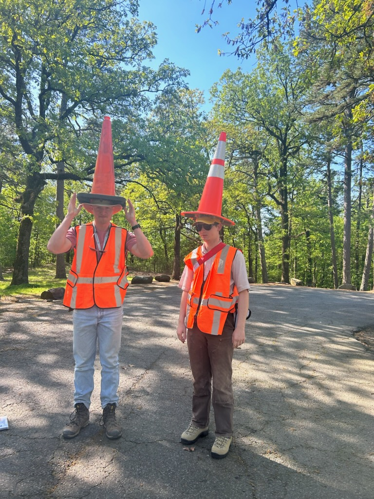

<!--  -->

 
**I like sed rocks and statistics**
 

  <a href="https://github.com/ethanoleson" style="
    display: inline-block;
    padding: 8px 14px;
    background: #219EBC;
    color: white;
    border-radius: 6px;
    text-decoration: none;
    font-weight: 600;
  ">Github</a>

  <a href="https://clastics.uark.edu/" style="
    display: inline-block;
    padding: 8px 14px;
    background: #219EBC;
    color: white;
    border-radius: 6px;
    text-decoration: none;
    font-weight: 600;
  ">CSRG Website</a>

  <a href="https://geosciences.uark.edu/" style="
    display: inline-block;
    padding: 8px 14px;
    background: #9D2235;
    color: white;
    border-radius: 6px;
    text-decoration: none;
    font-weight: 600;
   ">UArk Geosciences</a>

 
**Hi! I'm Ethan.** I am a Ph.D. student at the **University of Arkansas** in Fayetteville, AR. 

I am a geochronologist and sedimentologist who is interested in understanding the evolution of modern and ancient sedimentary systems and their linkages to tectonic processes through the use and development of thermo/geochronologic techniques.

I primarily work on detrital and igneous zircon UPb and AHe/ZHe.

Geo/Thermochronology ● Tectonic Sedimentology ● Basin Analysis ● Mathematical Modeling of Geologic Processes ● Geochronology Methods Development ● Geochronology Statistics ● U-series Geochemistry

## My CV:

**2024 – Present:** Ph.D. in Geosciences, University of Arkansas, Fayetteville.  

Advisor: Glenn R. Sharman

 

**2022 – 2024:** M.S. in Geology, University of Arkansas, Fayetteville.  

Advisor: Matthew D. Covington

 

**2018 – 2022:** B.S. in Earth Sciences (minor in math), Montana State University, Bozeman, MT.  

Advisor: Devon A. Orme

 

<a href="E_W_Oleson_CV_2025_geo.pdf" style="
  display: inline-block;
  padding: 8px 14px;
  background: #219EBC;
  color: white;
  border-radius: 6px;
  text-decoration: none;
  font-weight: 600;
">
  Download CV
</a>

## Frequent Collaborators
- [Matthew Malkowski](https://www.mmalkowski.com/) at UT-Austin

- Jack Fekete at BP p.l.c (formerly of the University of Arkansas)

- Boise State University Isotope Geology Laboratory

## Pages
- [Projects](projects.md)

  

Updated: 

