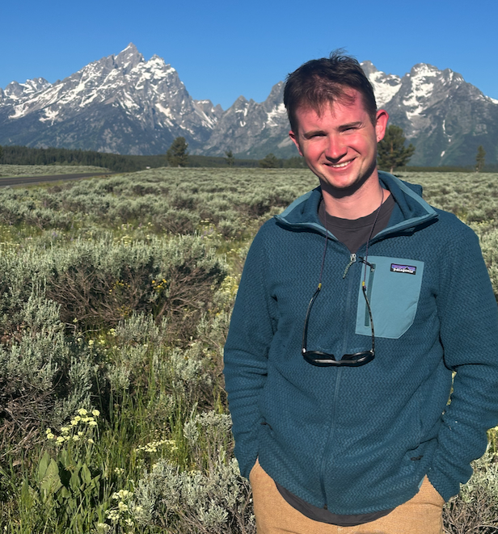

[Ethan's repos](https://github.com/ethanoleson) | [CSRG](https://clastics.uark.edu/)

Hi! I'm Ethan. I am a Ph.D. student at the University of Arkansas in Fayetteville, AR. 

I am a geochronologist and sedimentologist who is interested in understanding the evolution of modern and ancient sedimentary systems and their linkages to tectonic processes through the use and development of thermo/geochronologic techniques.

I primarily work on detrital and igneous zircon UPb and AHe/ZHe.

## My CV:

2024 - Present: Ph.D. in Geosciences, University of Arkansas, Fayetteville. 

Advisor: Glenn R. Sharman

2022 - 2024: M.S. in Geology, University of Arkansas, Fayetteville.

Advisor: Matthew D. Covington

2018 - 2022 B.S. in Earth Sciences (minor in math), Montana State University, Bozeman, MT. 

Advisor:  Devon A. Orme

[PDF of CV](E_W_Oleson_CV_2025_geo.pdf)

## Pages
- [Projects](projects.md)

## Code on GitHub

[Ethan's repos](https://github.com/ethanoleson)
